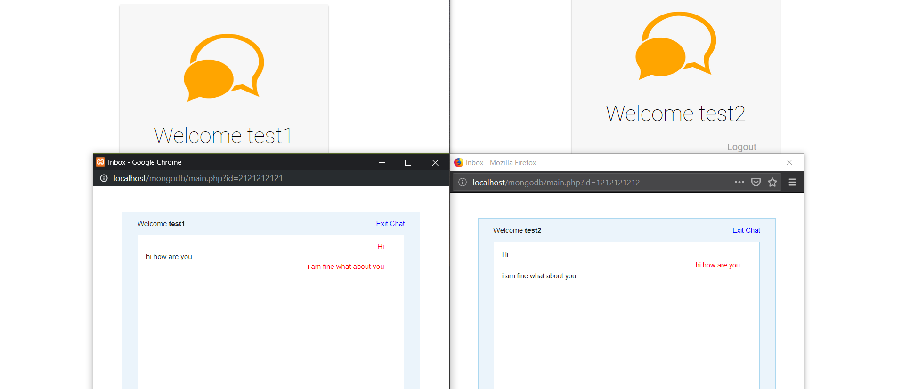

# MongoDB_Project
This is a web chat application which uses long polling and is made using HTML, CSS, AJAX, and mongodb.

To make use of this project one might need:-
  1. XAMPP to provide apache server to run .php files.
  2. mongodb server.
  3. mongodb php connector driver that can be installed from [here](https://getcomposer.org/) and following stepd from 
      [here](https://www.php.net/manual/en/mongodb.tutorial.library.php).
      

Most of the file's name in this project explains their purpose in project. 
experiment.php is a file which include code to add media transfer but its not included in the final version. I would love if someone can help
complete that. 
Facility of OTP is there in this project for new registration but you might have to use an API for that. 
We made use of [textlocal](https://www.textlocal.in/simple-developer-sms-api)'s
api but it provided only 10 free sms. So for time being once you have filled in Name, Password and Mobile number click on Get OTP and after that
put 123456 as the otp and hit Verify. You will be good to go.

Download the project and help modify.
